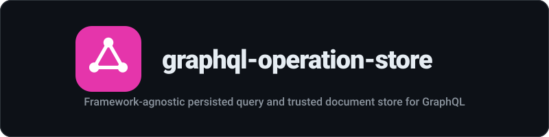

<div align="center">
  
</div>

<p align="center"><strong>Framework-agnostic persisted query and trusted document store for GraphQL</strong></p>

<p align="center">
  <a href="https://www.npmjs.com/package/graphql-operation-store"></a>
</p>

---
Framework-agnostic Automatic Persisted Queries (APQ) and trusted document store for GraphQL servers.

Extracts operations from client source at build time, validates incoming requests against a manifest at runtime. Works with any HTTP framework.

## Install

```bash
npm install graphql-operation-store
```

## How APQ Works

1. **Build time**: Extract all GraphQL operations from your client codebase into a manifest (hash -> operation mapping).
2. **Runtime**: Clients send only the operation hash instead of the full query string.
3. **Server**: Looks up the hash, finds the operation, and executes it.

Benefits:
- Smaller request payloads
- Prevents arbitrary queries in production (trusted documents)
- Protects against query abuse

### Protocol

Client sends:
```json
{
  "extensions": {
    "persistedQuery": {
      "version": 1,
      "sha256Hash": "abc123..."
    }
  }
}
```

Server resolves the hash to the full operation string and executes it. If the hash is unknown in strict mode, it returns:
```json
{
  "errors": [{ "message": "PersistedQueryNotFound" }]
}
```

## Usage

### Strict Mode (Production)

Only allow operations present in the manifest. Unknown hashes are rejected.

```typescript
import {
  createOperationStore,
  MemoryStorage,
  FileStorage,
} from 'graphql-operation-store';

// Option A: Load from a manifest file
const store = createOperationStore({
  storage: new FileStorage('./operation-manifest.json'),
  mode: 'strict',
});

// Option B: Load from a manifest object
const store = createOperationStore({
  storage: new MemoryStorage(),
  mode: 'strict',
});

await store.loadManifest({
  version: 1,
  operations: [
    { hash: 'abc123', document: 'query GetUser { user { id } }' },
  ],
});
```

### Allow-Unknown Mode (Development)

Allows arbitrary queries and registers them automatically.

```typescript
const store = createOperationStore({
  storage: new MemoryStorage(),
  mode: 'allow-unknown',
});
```

### Hono / Cloudflare Workers (Fetch API)

```typescript
import { Hono } from 'hono';
import {
  createOperationStore,
  FileStorage,
  fetchMiddleware,
} from 'graphql-operation-store';

const store = createOperationStore({
  storage: new FileStorage('./manifest.json'),
  mode: 'strict',
});

const app = new Hono();

app.post('/graphql', async (c) => {
  const mw = fetchMiddleware(store);
  const result = await mw(c.req.raw);

  if (result instanceof Response) {
    return result; // Error response (e.g., PersistedQueryNotFound)
  }

  // result is a new Request with the query filled in
  const body = await result.json();
  // Pass body.query to your GraphQL executor
});
```

### Express

```typescript
import express from 'express';
import {
  createOperationStore,
  MemoryStorage,
  expressMiddleware,
} from 'graphql-operation-store';

const store = createOperationStore({
  storage: new MemoryStorage(),
  mode: 'strict',
});

// Load your manifest
await store.loadManifest(require('./manifest.json'));

const app = express();
app.use(express.json());
app.use('/graphql', expressMiddleware(store));
```

### Build-Time Extraction

Extract operations from your client source code into a manifest:

```typescript
import { extractOperations } from 'graphql-operation-store';

await extractOperations({
  patterns: ['src/**/*.ts', 'src/**/*.graphql'],
  output: './operation-manifest.json',
});
```

This scans for:
- `gql\`...\`` template literals in `.ts`/`.js` files
- `.graphql` / `.gql` files

And produces a manifest JSON:

```json
{
  "version": 1,
  "operations": [
    {
      "hash": "a1b2c3...",
      "name": "GetUser",
      "document": "query GetUser { user { id name } }"
    }
  ]
}
```

## API

### `createOperationStore(opts: StoreOptions): OperationStore`

Creates a new operation store.

- `opts.storage` - A `Storage` implementation (`MemoryStorage`, `FileStorage`, or custom)
- `opts.mode` - `'strict'` rejects unknown hashes; `'allow-unknown'` accepts arbitrary queries

### `OperationStore.loadManifest(manifest: OperationManifest): Promise<void>`

Loads operations from a manifest object into storage.

### `OperationStore.resolve(hashOrQuery: string): Promise<string | null>`

Resolves a hash to an operation string. In `allow-unknown` mode, also accepts raw query strings.

### `MemoryStorage`

In-process Map-based storage.

### `FileStorage(manifestPath: string)`

Lazy-loads a JSON manifest file on first access.

### `fetchMiddleware(store: OperationStore)`

Returns a `(req: Request) => Promise<Request | Response>` handler for Web Standards environments.

### `expressMiddleware(store: OperationStore)`

Returns Express/Connect middleware.

### `extractOperations(opts: ExtractOptions): Promise<OperationManifest>`

Scans source files and produces an operation manifest.

## License

MIT
